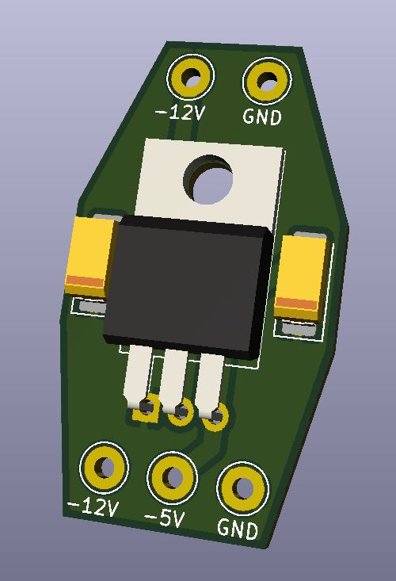
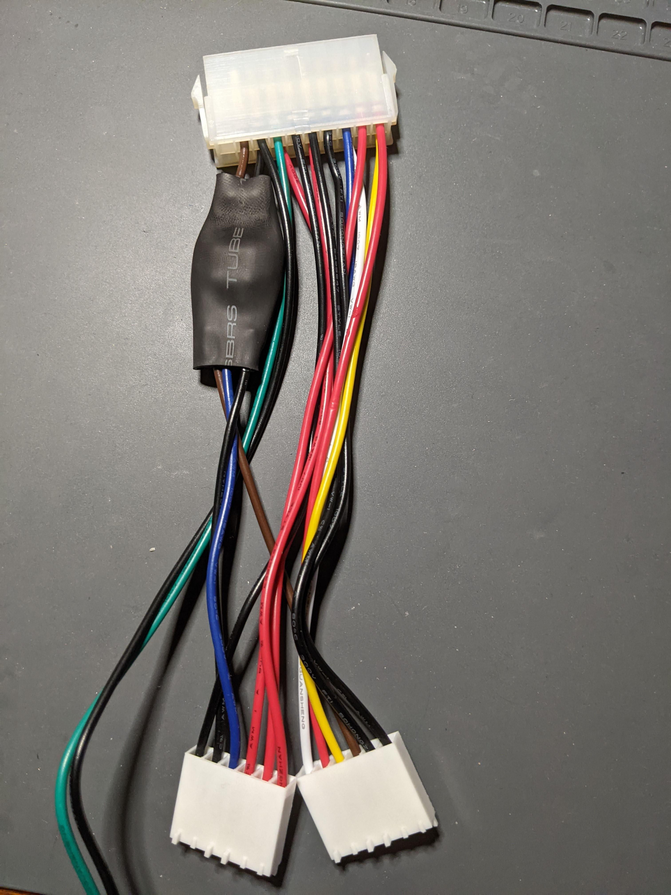

# ATX -5V Inline Adapter
A small inline adapter for an ATX power supply to generate -5VDC for Retro PC's connecting via AT P8/P9 connectors. This adapter has been tested and works great.

## Components Needed
* C1 - Kemet T491C225K025AT
* C2 - Kemet T491C105K050AT
* U1 - STMicroelectronics L7905CV
* PCB from the Gerber files in this project (JLCPCB, OSH Park, PCBway, etc.)
* ATX to AT wiring harness adapter (Aliexpress, Amazon, Ebay, etc.)
* Heatshrink tubing

## Installation
* Solder C1 and C2 capacitors.
* Solder U1, making sure to bend the legs at the appropriate length. Clip the excess.
* Use a reference of the ATX and AT power pinouts to find the -12V, -5V and GND connections on the ATX to AT harness. Be careful, because some of the harnesses have incorrect color wires.
* Cut the wires in an appropriate location to solder the -5V adapter in place. Start at the top side (ATX connector side) with -12V and GND wires.
* Strip the -12V and GND wires that are attached to the ATX connector side and solder them to the PCB side with the 2 plated through-holes.
* The -12V, -5V and GND on the AT side needs to be cut back to the length of the PCB and stripped.
* Place your heatshrink over the 3 wires and slide it down.
* Solder the -12V, -5V and GND from the AT side to the PCB with the 3 plated through-holes.
* Place the heatshrink over the PCB and heat it up to shrink it in place. This will protect against short circuits while installed in your computer.
* There should be one -5V wire hanging from the ATX side of your wire harness. Place some small heatshrink over the end of it to insulate it, or just remove it from the ATX side of the harness if you have the pin removal tool available.

This is what it should look like when finished!

## Other
This project is open source hardware. Do what you want with it.
